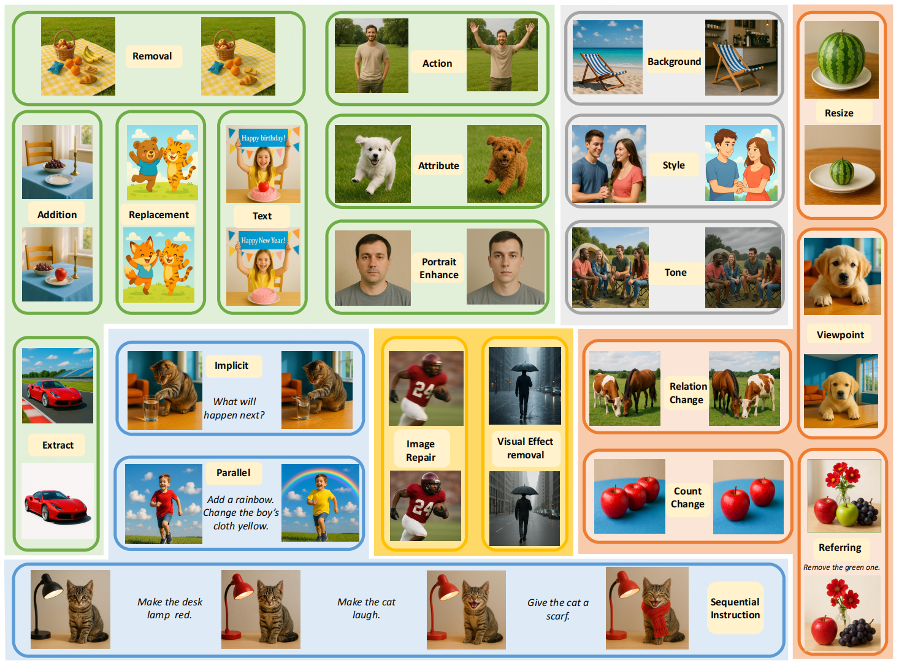
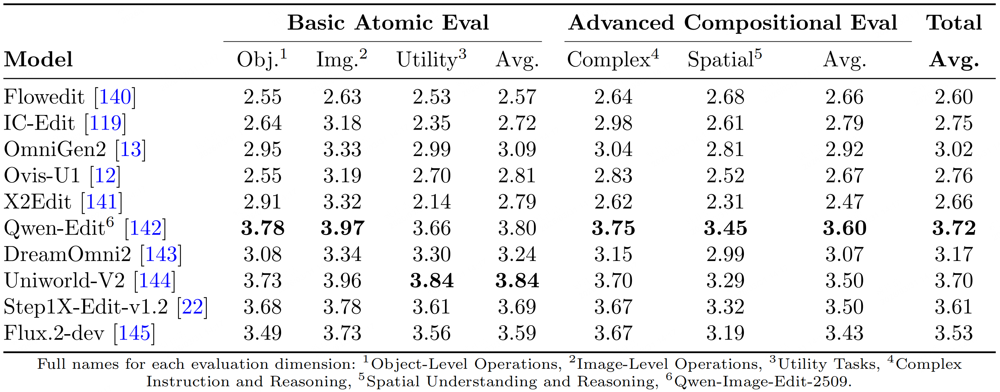

# CDD-IIE-Bench 📊
[📄 Report](https://link.springer.com/content/pdf/10.1007/s44336-026-00034-3.pdf) | [🤗 HuggingFace](https://huggingface.co/datasets/zangxh/CDD_IIE_Bench)


## Latest Updates 🚀
- [x] 2026.03.31 Released CDD-IIE-Bench evaluation set and standards
- [x] 2026.03.31 Manual evaluation results of current latest open-source models
- [ ] Manual evaluation results of current latest closed-source models are in progress...

## Dataset Introduction 📚
We are excited to share our latest research—CDD-IIE-Bench v1.0!
This is an open-source evaluation suite for Instruct-based Image Editing (IIE) tasks, dedicated to providing Comprehensive, in-Depth, and Diagnostic (CDD) evaluation standards. The dataset consists of 2 major categories, 5 intermediate categories, 21 sub-categories, and 33 fine-grained categories, totaling 1,341 test cases.


# Evaluation Standards ⭐ 
To ensure evaluation accuracy, we employ manual evaluation (Golden Metric). Twelve vision experts randomly ordered generated images from different models under the same instruction. For 21 evaluation tasks, each task has 3 specific evaluation dimensions and a 5-point rating scale (where 1 = Poor, 5 = Excellent). Each level has clear criteria. For instance, the "Object Addition" task includes three dimensions: "Instruction Adherence," "Visual Naturalness," and "Physical and Detail Consistency." The 5-point standard for "Instruction Followed" is as follows:
* Score 5: All specified attributes are correct and scene logic is coherent; only minor microscopic imperfections.
* Score 4: Main attributes correct; only slight deviations in details or 1-2 small features missing.
* Score 3: Correct category but key attributes (position, color, size, quantity, etc.) are incorrect.
* Score 2: Added object category is wrong or unrelated to the instruction.
* Score 1: No content added, or added content is damaged/invalid.

For more specific standards, please refer to [Detailed Evaluation Standards](evalMetrics/metrics_en.md)

# Evaluation Objects 🎯 
We conducted manual evaluations on the current latest open-source instruction-based editing models, and the results are shown below:



# References 📖
```shell
@article{zang2026instruction,
  title={Instruction-based image editing: a survey on data, models, evaluation, and applications},
  author={Zang, Xianghao and Jiang, Zijian and Cheng, Jiarong and others},
  journal={Vicinagearth},
  volume={3},
  number={1},
  pages={3},
  year={2026},
  publisher={Springer} 
} 
```
